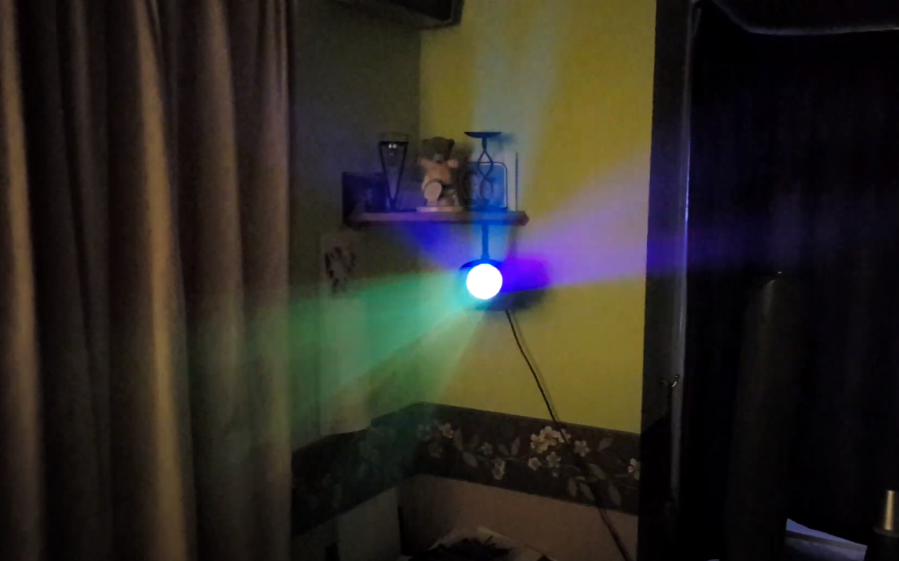

# arduflower
# Arduino based moonflower disco light

This is my first ever project on github, and also the first time I have written code from scratch for a very long time. There are likely to be bugs, bad coding practices and plain stupidity in circuit design or component use. I have tested it all, the circuit and the code runs fine for hours so nothing major wrong with it at least!

I used a WS2812b 8x8 LED matrix which is attached to a 3D printed piece so it slots in where the old LED board used to be. I have used the original PSU that came in the light, and a boost converter to bring it up to a solid 5v as it was only putting out 4.2v (If anyone can advise how to modify the original PSU to put out 5v that would be great). This is powering an Arudino Nano running some FastLED matrix code which I have been using to make moonflower type patterns for beam effects. I have made around 30 patterns so far. I have also used the original potentiometer to adjust the speed of the patterns so its possible to match it to music somewhat. The modified light has a much better spread than the original, and is also brighter! The beam effects are like a poor mans laser scanner. Total build cost is in the region of around £35 which includes purchasing the original light too!

I was working on a sound reactive mode, but as this is my first Arduino project from scratch that part is stumping me for now. I have the input side all worked out using a voltage divider for a line in input and get what look like useful readings from the analog input, but am unsure how to make a BPM detector that would work alongside my code for the moonflower patterns. I will keep working on it but if anyone can suggest how to do it I would be very grateful!

The fan in the picture is a 12v fan, its connected to the spare pads on the PSU which are putting out around 4.2v under load. Its just to keep some air flowing through the light. Due to being a 12v fan running on 4.2v it is almost silent.

Some code is borrowed from the fastLED and fastLED matrix example files, they have been a great resource for learning how to address the matrix.

If anyone knows of a way to get this any brighter I am open to all suggestions!

I hope this is useful to someone, I think its kinda cool ;)

# WARNING

Using this code and building this is at your own risk. Test all connections and check for shorts before applying power! Be VERY careful of the PSU as it has mains voltage running through it when live.

When tuning the boost converter, do so BEFORE connecting to the main circuit. I found mine was set to 24v when I got it! Adjust and check with a meter as the display may not be 100% accurate

# How it works

The code makes a list of available patterns called gPatterns. I wanted to ensure that patterns would be shown only once per rotation, so I make an array holding numbers from 0 to the total number of patterns in gPatterns. The code then shuffles the array of numbers using a simple swap routine. I started originally by using a random generator and switch, however this sometimes ended up causing large delays as it worked its way to the end of available patterns.

The random colour generator works in a similar way, holding an array of 0 to 6 and then shuffling them each time pickcolourset is called. Then we use this array to assign colours to colour1, colour2, colour3 and colour4 for use in the effects by using a switch command on the first 4 variables from the array.

The potentiometer is used to adjust the delay between each frame, it could be easily tweaked to adjust the amount of time a pattern is shown for and then use a fixed number for the delay between each frame.

The patterns themselves are made using fastLED matrix commands, I haven't been able to find a guide to what is actually available so have figured out what I am using by going through the example code.

If you add a pattern, be sure to add its name to the gPatterns list so that it gets included in the rotation!

# Parts List

* RGBW Airship disco light - https://amzn.to/2XGAL9M
* 8x8 2812b LED matrix - https://amzn.to/2XFtiHX
* Arduino Nano - Listing is for 3 - https://amzn.to/2XFu1Jb
* 5v boost converter - https://amzn.to/2X9dmPl

Used original PSU and 50k potentiometer.

*Links are amazon associate links which means I get a little tip if you use them, you pay no more than usual by doing this.

# To Do

* Improve LED mount STL to add some better way to attach the board to it. Currently I am using sellotape, you could glue it in place.
* Make 3D Printed mount for arduino nano so its not just floating around inside the case.
* Figure out how to make a sound reactive mode / BPM counter from line input.
* Make some way to chain multiple lights.
* Look at other potential controllers for connectivity related to chaining.
* Moar and betterer patternz!

# Crude circuit diagram

I hope people can follow this. Not included in the picture is a 12v fan which is soldered to the pads next to the output socket on the original PSU. It runs very quieltly on the 4.2v ish output from the PSU.

# Original Internals

Borrowed this frame from bigclivedotcom's video on youtube as I didn't think to take a picture before I ripped it all apart. I hope he doesn't mind if he see's this :) You should go watch his video here https://www.youtube.com/watch?v=sWjRAizFKho to see another modification for this light!

# Prototype build

You can't really see it, however the arduino nano is the black heatshrinked thing in the top right of the case with wires coming out of it. I really need to make a proper mount for it...

# Demo Video
Please click on the picture or the link below to go to the video as I can't embed apparently.

https://www.youtube.com/watch?v=sVy2k0N5fuQ

